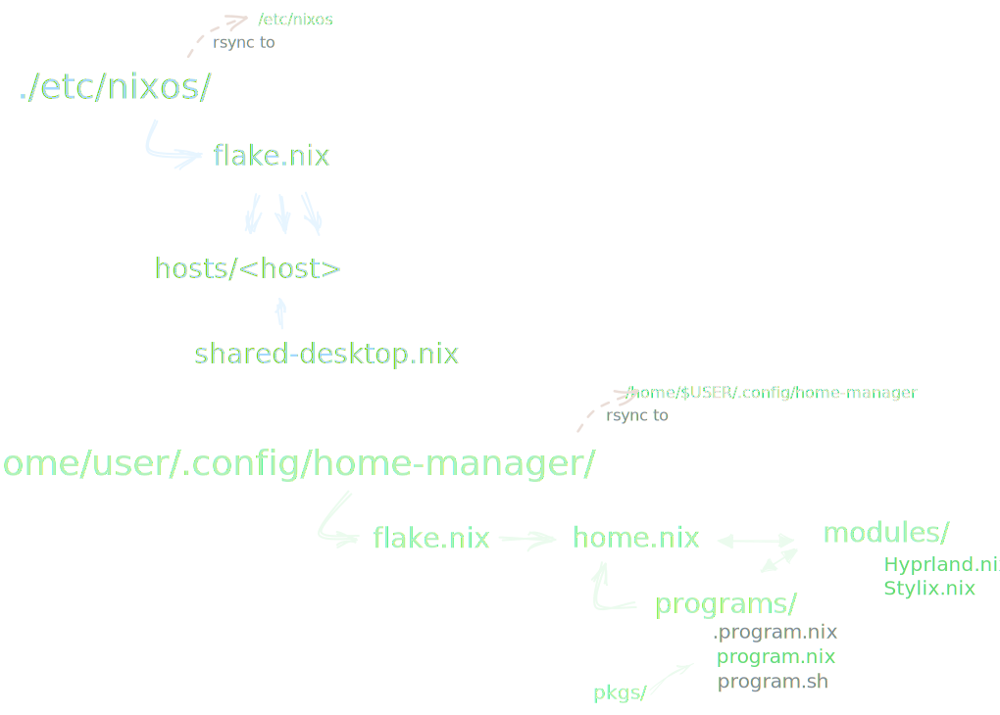

# ❄️NixOS desktop

My solution to a full [NixOS](https://nixos.org/) / [Hyprland](https://hyprland.org/) desktop. Its used as a daily driver (so it will change from time to time).

I tried to make my configuration as simple as possbile to understand. I also pasted some links to helpful websites into the sourcecode and left some personal notes.

Feel free to copy'n'paste as you like.

## Programs and Features

-   🔄 made for synchronizing between multiple hosts
-   ⬆️ Apply and upgrade scripts

### System

-   Declare **multiple hosts** but still some **shared configuration** ↔️
-   📦 Flatpak support

### Home

|                 🧍 | standalone                    |
| -----------------: | :---------------------------- |
|  Window manager 🌿 | Hyprland                      |
|        Terminal ⬛ | kitty                         |
|           Shell 🐚 | zsh, _bash(disabled)_         |
|          Prompt 🗣️ | starship                      |
|    File manager 🗃️ | nautilus, _pcmanfm(disabled)_ |
|          Editor 📝 | micro, vscodium               |
|         Browser 🐺 | librewolf                     |
|         Theming 🖌️ | Stylix (colors & fonts)       |
|         Network 🌐 | connman                       |
|             VMs 🪟 | gnomeboxes                    |
| Session looking 🔒 | swaylock                      |

## Strucure



## Installation

### Base System

`etc/nixos/`

1. Install [NixOS](https://nixos.org/) on a machine.
    - NOTE: You can use any environment you want, it doesn't matter because we are changing the configuration anyway.
2. Enable Flakes

    1. add `nix.settings.experimental-features = [ "nix-command" "flakes" ];` to your current config
    2. `nixos-rebuild switch`

3. Download this repository and put it somewhere to _`~/Desktop`_ for example
4. Make some changes to my sourcecode in _`./etc/nixos/`_
    1. Create your own `Host.nix`.
        - NOTE: You can use my _`hosts/Generic.nix`_ and your _`/etc/nixos/configruation.nix`_ from your installation for help. See my existing devices what should be in this file.
    2. change locale, username, hostname, etc.
    3. add more packages you would like to use for every user and root
    - NOTE: Dont touch your `hardware-configuration.nix`. If you messed up you can regenerate it with `sudo nixos-generate-config`
5. Run the script _`./apply_etc.sh`_
    1. It will make a backup of `configuration.nix`.
    2. It copies _(overrides)_ the contents from _`./etc/nixos/`_ to _`/etc/nixos`_.
    3. It automatically tests your configuration with `sudo nixos-rebuild test`
    - NOTE: First test/switch can take >20min to complete (because of comilations)!
    - Nice2know: `sudo nixos-rebuild build-vm-with-bootloader` to create a virtual machine. See the `--help` page
6. _If everything works,_ make the configruation the default boot with `sudo nixos-rebuild switch` or `./apply_etc.sh switch`

Now you have the base NixOS system. Delete my hosts and adjust my shared-desktop to your needs.

### Home-manager standalone

I prefered the standalone installation because i don't want to use sudo and rebuild my enire system to only apply some home changes. Plus I **could** theoretically install Home-manager to any linux distribution and apply my config. But i haven't tested this yet.

1. Download this repository and put it somewhere to _`~/Desktop`_ for example
2. Make some changes to my sourcecode in _`./home/user/.config/home-manager/`_
    - the username should be your own
3. Run the script _`./apply_home.sh`_
    1. It installs home-manager if not available (with `nix-shell -p home-manager`)
    2. It rsync _(updates)_ the contents from _`./home/user/.config/home-manager/`_ to _`~/.config/home-manager`_
    3. It applies changes with a `home-manager switch`
    - NOTE: First switch takes ~5min on my machines.

### Bugs'n'Fixes

#### eww

Yea, i know my eww configuration isn't finished and still lacking. I will work on it from time to time.

##### symlink eww config directory

You have to manually make a symlink to _`~/.config/eww`_ in order for eww to work.

```shell
ln -s ~/.config/home-manager/modules/eww ~/.config/
```

I setup mine to my repository for better developing.

```shell
ln -s ~/Desktop/NixOS-hm-standalone/home/user/.config/home-manager/modules/eww ~/.config/
```

#### Flatpak

Run the script `./home/user/.config/home-manager/programs/flatpaks.sh` to add the flathub repository and install some specified flatpaks.

If you also want to manage your Flatpaks declarively look at [this](https://github.com/GermanBread/declarative-flatpak) project. I might switch to it in the future.

##### Theming

See [Flatpak applications can't find system fonts](https://nixos.wiki/wiki/Fonts#Flatpak_applications_can.27t_find_system_fonts)

```shell
flatpak --user override --filesystem=~/.local/share/fonts:ro
flatpak --user override --filesystem=~/.icons:ro
flatpak --user override --filesystem=~/.themes:rof

# GTK
flatpak --user intall org.gtk.Gtk3theme.adw-gtk3-dark

# QT
flatpak --user remote-add kdeapps https://distribute.kde.org/kdeapps.flatpakrepo
flatpak --user install kdeapps org.kde.KStyle.Adwaita//5.9
flatpak --user install kdeapps org.kde.PlatformTheme.QGnomePlatform//5.9
```

## Usage

[A helpful NixOS Guide](https://github.com/mikeroyal/NixOS-Guide#table-of-contents)

### Applying changes

`./apply_etc.sh` to test your changes in _`etc/nixos/`_
`./apply_etc.sh switch` to apply your changes in _`etc/nixos/`_

`./apply_home.sh` to sync and do a `home-manager switch`

`./apply_all.sh` will apply both with a `switch`

### Updating / -grading

`./upgrade_etc.sh` will do:

1. remove the _`flake.lock`_ file in /etc
2. rebuild the system
3. sync _`flake.lock`_ to this repository (only local)

`./upgrade_home.sh` will do:

1. remove the _`flake.lock`_ file in /home
2. rebuild the home
3. sync _`flake.lock`_ to this repository (only local)
4. update the flatpaks

### Network

`connman-gtk` or `ALT SUPER + N`

### Syncronisation

syncthing: <http://localhost:8384>

### Nix in general

Rollback:

-   NixOS: `nix profile rollback {--to <n>}`
-   Home-manager: See <https://nix-community.github.io/home-manager/index.html#sec-usage-rollbacks>

Cleanup:

-   `nix-collect-garbage` deletes unreachable packages
-   `nix-collect-garbage --delete-old` also deletes previous generations (rollbacks), be careful with that!

Build without internet:

- `nixos-rebuild switch --option substitute false`
- `nixos-rebuild switch --option binary-caches ""`
